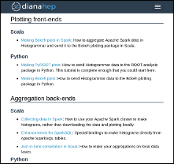
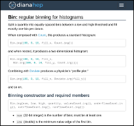
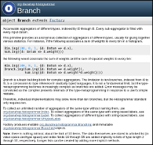
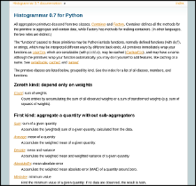

<h2><a href="install">Installation</a></h2>

Getting it.

<h2><a href="tutorials">Tutorials</a></h2>

How to make plot X from data Y.

<h2><a href="specification">Specification</a></h2>

How every primitive should behave in every language.

<h2><a href="http://histogrammar.org/scala/latest/#org.dianahep.histogrammar.package">Scala reference</a></h2>

Scaladocs for the latest version of Histogrammar-Scala.

<h2><a href="http://histogrammar.org/python/latest/">Python reference</a></h2>

Sphinx docs for the latest version of Histogrammar-Python.

## Reporting bugs

Report implementation errors on the GitHub Issues tab of the corresponding language version:

   * Scala: [histogrammar-scala/issues](https://github.com/histogrammar/histogrammar-scala/issues)
   * Python: [histogrammar-python/issues](https://github.com/histogrammar/histogrammar-python/issues)
   * C++: [histogrammar-cpp/issues](https://github.com/histogrammar/histogrammar-cpp/issues)
   * Julia: [Histogrammar.jl/issues](https://github.com/histogrammar/Histogrammar.jl/issues)

Report general problems, such as inconsistencies in the specification or cross-language feature requests, on [histogrammar-multilang/issues](https://github.com/histogrammar/histogrammar-multilang/issues).

Report errors in this documentation to [histogrammar-docs/issues](https://github.com/histogrammar/histogrammar-docs/issues).

## For developers

   * [GitHub wiki](http://github.com/histogrammar/histogrammar-multilang/wiki) for status, roadmap, and proposals.
   * [Slack project](http://histogrammar.slack.com/) for communication among developers and with users (request invitation from [pivarski@fnal.gov](pivarski@fnal.gov)).
   * [Travis-CI](http://travis-ci.org/histogrammar) for the current build state of all Histogrammar repositories.
