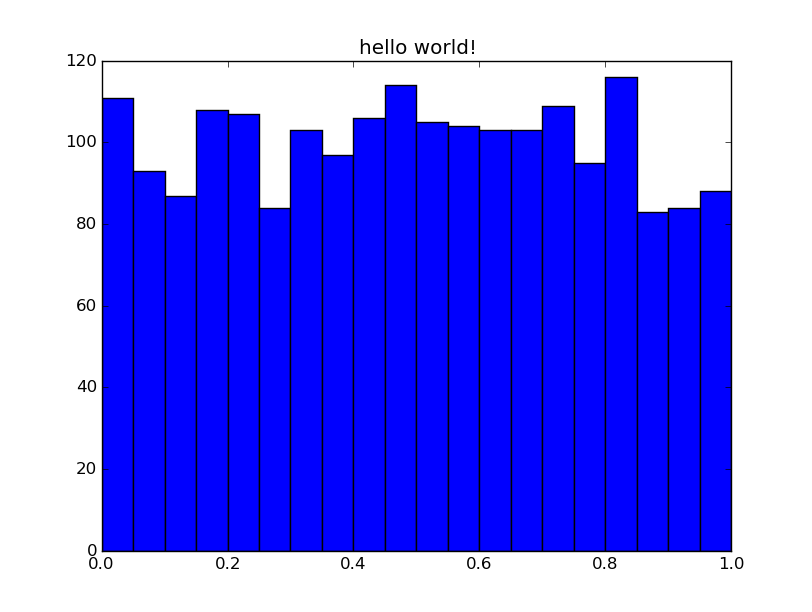

## Preliminaries

This tutorial demonstrates the use of the Python version of Histogrammar.  See
the [installation guide](../../install) for installing version 0.7 or later.  

## Introduction

Histogrammar is an easy to use and powerful toolkit for aggregating data.  It
provides the building blocks and the back-end logic to make one or many
dimensional histograms, bar charts, box plots, efficiency plots, etc.   Before
aggregating any data, the user declaratively writes the structure of the
desired aggregation using Histogrammar's simple and consistent grammar, and also
provides the rules to fill the structure with data as a user defined function
(usually a quick lambda function does the trick).  Histogrammar takes care of
the rest.  The user does not write the logic that actually makes the histogram,
no nested for loops, no map and reduce operations, no handling of bug-prone
edge cases --- this is taken care of by histogrammar's implementation.

## First histogram

Histogrammar's scope and usage is best demonstrated with a series of examples.
After covering the basics, a more interesting dataset will be used to motivate
histogrammar's more advanced features.

Lets make a histogram with 20 equally spaced bins of uniform random numbers,
whose range is from zero to one.  It makes one pass over a data stream.  Let's
call this histogrammar's "hello world!":

```python
import histogrammar as hg

# generate a stream of uniform random numbers
import random
data = [random.random() for i in xrange(2000)]

# aggregation structure and fill rule
histogram = hg.Bin(num=20, low=0, high=1, quantity=lambda x: x, value=hg.Count())

# fill the histogram!
for d in data:
    histogram.fill(d)

# quick plotting convenience method using matplotlib (if the user has this installed)
ax = histogram.matplotlib(name="hello world!")

# to improve plot styling, try adding **kwargs suitable for plt.bar
#  e.g.: ax = histogram.matplotlib(name="hello world!", color="slategrey", edgecolor="white")
```
If the plot doesn't show up in your IPython terminal, you may need to turn
interactive mode on, `plt.ion()`, or call `plt.show()`.

The first three arguments to `hg.Bin` are pretty self explanitory.  `num` is
the number of equal width bins to use.  The `low` and `high` parameters are the
lower and upper boundaries.

With `hg.Bin`, the user can also specify:

  * `underflow`: what to do with data below the low edge;
  * `overflow`: what to do with data above the high edge;
  * `nanflow`: what to do with data that is not a number (`NaN`).

The default for these is `Count()`.

Most of the action happens in `value` and `quantity` parameters.


## Composability

### `quantity`, the fill rule
`quantity` is the *fill rule*: a lambda or normal python function that is
responsible for extracting the quantity we are interested in from a single data
point in the dataset.  Since our dataset in the above example was a list of
numbers, not much happens in the fill rule.  Often the data we are interested
might be buried in a series of complicated objects.  The quickest thing for an
analyst to do in this case is usually loop over objects while extracting the
elements of interest into an array.  Then a second pass is made over the data
to do the aggregation.  The fill rule is where this logic belongs:

```python
# The data of interest (value) is buried within some unweildy object (DataPoint)
class DataPoint(object):
    def __init__(self, value):
	    self.value = value

data = [DataPoint(random.random()) for i in xrange(2000)]
histogram = hg.Bin(num=20, low=0, high=1, quantity= lambda x: x.value, hg.Count())
```

What if we want to do something histogrammar doesn't have built in, like making
a histogram with a logarithmically spaced binning?  One option is to take
advantage of histogrammar's use of user-defined fill rules.

```python
import math
data = [random.random()*100000 for i in xrange(5000)]
histogram = hg.Bin(num=6, low=0, high=6, quantity=lambda x: math.log10(x), value=hg.Count())
for d in data:
    histogram.fill(d)
```

### `value`, the aggregator
Finally, we give the `value` parameter a histogrammar object that is the actual
aggregator.  So far we have demonstrated `Count`.  `Count` is a simple counter
that adds one to a total each time it is called.  At this point we can start to
see histogrammar's grammar taking shape.  Notice that `Bin` is a noun, and
`Count` is a verb.  *Count the number of data points that fall within each
bin*. 

There are several primitives of this type available, such as `Sum`, `Deviate`,
`Minimize`, `Maximize`, and more.  They may not be so useful on their own, but
the different aggregators each have their own fill method:

```python
data = [random.random() for i in xrange(1000)]
counter = hg.Count()
minimum = hg.Minimize(lambda x: x)
deviate = hg.Deviate(lambda x: x)
for i, d in enumerate(data):
    counter.fill(d)
    minimum.fill(d)
    deviate.fill(d)
    # print aggregator state every 200th iteration
    if i % 200 == 0:
        print "\n - Iteration", i
        print counter
        print minimum
        print deviate
```

All the primitives except `Count` have a fill rule.  To see why, we'll generate
a two dimensional dataset.

The `x1` variables are normally distributed with a mean given by `x2`, which is
a variable with a uniform distribution between 0 and 1.  The variance of `x1`
is one.

```python
x2 = [random.random() for i in range(5000)]
x1 = [random.gauss(x, 1) for x in x2]
data = zip(x1, x2)

h = hg.Bin(20, 0, 1, lambda x: x[1], hg.Deviate(lambda x: x[0]))
for d in data:
    h.fill(d)

ax = h.matplotlib("profile plot", aspect=False, lw=2, color="slateblue")
ax.set_ylabel("$\\mathrm{x}[1] \\pm 1\\sigma$")
ax.set_xlabel("$\\mathrm{x}[0]$")
```
Note that a "profile plot" usually gives the error on the mean, and can be
turned on by setting `aspect=True`.


### Filling the histogram with data

As you have probably noticed, the `histogram` object is empty until filled with
data.  Part of what makes histogrammar powerful is the back-end implementation.
Notice that the fill method of the
[Bin][http://histogrammar.org/python/0.7/histogrammar.primitives.bin.Bin.html]
object only has two arguments: `datum` (also the input to the *fill rule*) and
an optional `weight` for that `datum`.  How the aggregation is actually
implemented under the hood is taken care of by histogrammar.

This includes the appropriate handling of nans, infs, and datapoints that fall
above and below the `high`/`low` boundaries.  For example:

```python
data = [random.random() for i in range(2000)]

# add some "bad" values into the dataset
data.extend([float('nan'), float('inf'), float("-inf"), 100, -100])
h = hg.Bin(num=20, low=0, high=1, quantity=lambda x: x, value=hg.Count())
for d in data:
    h.fill(d)

# histogrammar has kept track of these
print "NaN counter:       ", histogram.nanflow
print "overflow counter:  ", histogram.overflow
print "underflow counter: ", histogram.underflow
```

The most efficient way to fill the initially empty aggregation depends on the
computing environment of the user.  On a single machine, a single pass over the
data using the `fill` method is the best we can do.  If, for example, we are
working in a distributed computing cluster running [Apache
Spark][http://spark.apache.org/] and our dataset was a large resilient
distributed dataset (RDD) we would efficiently fill the aggregation like this
(in a PySpark prompt) without using a for loop:

```python
data.aggregate(histogram)(hg.increment, hg.combine)
```

`increment` is similar to `fill`, and `hg.combine` merges two aggregations into
one.  Notice what `(h + h).matplotlib()` does.

Other pages in the documentation provide more detail on using histogrammar in
different computing environments.

### Exporting results

The aggregated data is easily accessible as attributes.  If you are using an
IPython terminal type h.<tab>, or dir(h).  Try printing `h.values`.  If a
plotting method doesn't exist for your histogrammar structure, this is how you
extract the results.

Histogrammar also can export its results in a consistent
[JSON][https://en.wikipedia.org/wiki/JSON] format.  This allows results to be
saved to disk in a standardized manner.

```python
# as python objects (dicts, lists, etc.)
print h.toJson()

# and as a JSON string, ready to write to disk
import json
print json.dump(h.toJson())
```

## Realistic Examples

The next series of examples follows the PyROOT tutorial and shows of some of
the more advanced histogrammar aggregations and quick matplotlib plotting
methods.  First let's load in the CMS data used in the other examples:

```python
events = EventIterator()
```

The following series of examples is meant to highlight histogrammars
composability, and to highlight how this enables interesting aggregations to be
easily made.  As you may have noticed, from how `Count` can be used similarly
to `Bin`, why not do a `Bin` of `Bin` of `Count`.  This creates a 2 dimensional
histogram:

```python
hist2d = hg.Bin(50, -100, 100, lambda event: event.met.px,
             value = hg.Bin(50, -100, 100, lambda event: event.met.py))

for i, event in enumerate(events):
    if i == 5000: break
    hist2d.fill(event)

ax = hist2d.matplotlib(name="2 dimensional histogram")
ax.set_ylabel("met py")
ax.set_xlabel("met px")
```


