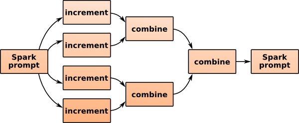

## Preliminaries

This tutorial uses the Scala version of Histogrammar. See the [installation guide](../../install) for installing version 0.7.1 or later.

It also uses Apache Spark. You might already have access to a Spark cluster (and that's why you're here, after all), but if you don't, you can install it yourself [from Spark's website](http://spark.apache.org/downloads.html). Spark can run on a single computer for testing, though its performance advantage comes from parallelizing across a network. The interface on a single computer is identical to the distributed version. For a single-computer installation, choose "pre-built for Hadoop 1.X" (you don't need Hadoop to be installed, only Java). Histogrammar 0.7.1 is built for a version of Scala that is compatible with Spark 1.6.1, so use that, not 2.0.

Start Spark with Histogrammar loaded like this (and combine with any other options your cluster needs; the following is sufficient for a single-computer installation):

```bash
spark-shell --jars=histogrammar-0.7.1.jar
```

Finally, this tutorial uses the CMS public data as an example. You can load it into Spark by first following the instructions on the [CMS data page](../scala-cmsdata)* and then uploading them to Spark with this command:

```scala
val rdd = sc.parallelize(events.toList)
```

Unlike the other tutorials that download events as you need them, this one downloads them all and puts them in your local Spark installation. It can take 20-30 seconds. Once that's one, you're ready to start analyzing data.

(*If you're familiar with Scala and are thinking about using `:paste` mode to enter the CMS dataset code, don't. It breaks type inference in Spark's `aggregate` method.)

## First histogram

Simple things first: you have some data in Spark (`rdd`) and you want to see how they're distributed. How do you to that in Histogrammar?

Like this:

```scala
import org.dianahep.histogrammar._

val empty = Bin(10, 0, 100, {event: Event => event.met.pt})

val filled = rdd.aggregate(empty)(new Increment, new Combine)

import org.dianahep.histogrammar.ascii._
filled.println
```

The output should look like

```
                       0                                                     133316
                       +----------------------------------------------------------+
underflow     0        |                                                          |
[  0 ,  10 )  6.697E+4 |*****************************                             |
[  10,  20 )  1.212E+5 |*****************************************************     |
[  20,  30 )  1.047E+5 |**********************************************            |
[  30,  40 )  8.037E+4 |***********************************                       |
[  40,  50 )  5.257E+4 |***********************                                   |
[  50,  60 )  2.605E+4 |***********                                               |
[  60,  70 )  1.035E+4 |*****                                                     |
[  70,  80 )  3913     |**                                                        |
[  80,  90 )  1525     |*                                                         |
[  90,  100)  717      |                                                          |
overflow      1061     |                                                          |
nanflow       0        |                                                          |
                       +----------------------------------------------------------+
```

### What just happened?

The second line,

```scala
val empty = Bin(10, 0, 100, {event: Event => event.met.pt})
```

defines an empty histogram that would count missing transverse energy (MET) in ten bins. Then instead of filling it directly, we pass it to Spark's aggregate:

```scala
val filled = rdd.aggregate(empty)(new Increment, new Combine)
```

Spark sends copies of the empty histogram to all computers in the network along with the `Increment` and `Combine` functions (created on the spot with `new`, satisfying the type constraints). The partial histograms are remotely incremented on the distributed dataset and then combined as they're gathered back. The dataset could be enormous, but the only data that get transmitted across the network are in the reduced form: the histogram. If you're using a single-computer installation, this process is only simulated.



Notice that the histogram you got back is not the one you sent:

```scala
scala> println(empty.entries)
0.0

scala> println(filled.entries)
469384.0
```

Spark manages the partial copies and the merging, including clean-up and recomputation if a remote node fails. The `aggregate` line above is equivalent to creating a histogram-filling script, submitting it to a computing cluster, resubmitting failed jobs, then downloading only the good results and adding them bin-by-bin. Since it's a one-liner, it's easy enough to use in exploratory data analysis.

Finally, about the ASCII-art histogram: this tutorial is meant to highlight the aggregation method only. For a better plotting front-end, combine it with one of the other tutorials. For instance, you could plot the results directly [in Scala with the Bokeh library](../scala-spark-bokeh) or have Scala write to a pipe and view the events in a Python plotter (such as [Matplotlib](../python-basic) or [PyROOT](../python-pyroot)) using [HistogrammarWatch](../python-hgwatch).

## Many histograms at once

Transporting data is almost always more expensive than performing calculations, so it's usually advantageous to submit one job that fills a hundred histograms than a hundred jobs filling one histogram each. (Even if you use Spark's `rdd.persist()` to cache data in RAM, there's still the transport from RAM to CPU.) As you develop your work, you'll want to bind histograms together.

Here's how to do that:

```scala
val empty = Label(
  "METx" -> Bin(10, 0, 100, {event: Event => event.met.px}),
  "METy" -> Bin(10, 0, 100, {event: Event => event.met.py}),
  "MET" -> Bin(10, 0, 100, {event: Event => event.met.pt}),
  "numPrimary" -> Bin(10, 0, 20, {event: Event => event.numPrimaryVertices}))

val filled = rdd.aggregate(empty)(new Increment, new Combine)
```

Now `empty` is four empty histograms, each with a different label. If you're not familiar with Scala, the `->` syntax creates key-value pairs in the same sense as `:` in a Python dictionary. The `Label` is a member of the same class as `Bin`, with increment and combine operations, so it fills the same way. To get individual histograms out, do this:

```scala
filled("METx").println
filled("METy").println
filled("MET").println
filled("numPrimary").println
```

**[Label](../../specification/#label-directory-with-string-based-keys)** and **[Bin](../../specification/#bin-regular-binning-for-histograms)** are both interchangeable primitives. The idea is that you can build any kind of aggregation by combining primitives in different ways. For instance, if you wanted a histogram whose bins are directories of other histograms, you could do that.

```scala
val empty = Bin(5, 0, 20, {event: Event => event.numPrimaryVertices}, Label(
  "METx" -> Bin(10, 0, 100, {event: Event => event.met.px}),
  "METy" -> Bin(10, 0, 100, {event: Event => event.met.py}),
  "MET" -> Bin(10, 0, 100, {event: Event => event.met.pt})))

val filled = rdd.aggregate(empty)(new Increment, new Combine)
```

Here is the MET for number of primary vertices between 0 and 4:

```scala
println(filled.range(0))  // prints the range of the first bin, (0.0,4.0)

filled.values(0)("MET").println
```
```
                       0                                                    11316.8
                       +----------------------------------------------------------+
underflow     0        |                                                          |
[  0 ,  10 )  7482     |**************************************                    |
[  10,  20 )  1.029E+4 |*****************************************************     |
[  20,  30 )  8859     |*********************************************             |
[  30,  40 )  9110     |***********************************************           |
[  40,  50 )  6024     |*******************************                           |
[  50,  60 )  2471     |*************                                             |
[  60,  70 )  830      |****                                                      |
[  70,  80 )  317      |**                                                        |
[  80,  90 )  109      |*                                                         |
[  90,  100)  61       |                                                          |
overflow      132      |*                                                         |
nanflow       0        |                                                          |
                       +----------------------------------------------------------+
```

And here it is between 4 and 8:

```scala
println(filled.range(1))   // (4.0,8.0)

filled.values(1)("MET").println
```
```
                       0                                                    58080.0
                       +----------------------------------------------------------+
underflow     0        |                                                          |
[  0 ,  10 )  3.070E+4 |*******************************                           |
[  10,  20 )  5.280E+4 |*****************************************************     |
[  20,  30 )  4.334E+4 |*******************************************               |
[  30,  40 )  3.438E+4 |**********************************                        |
[  40,  50 )  2.345E+4 |***********************                                   |
[  50,  60 )  1.132E+4 |***********                                               |
[  60,  70 )  4216     |****                                                      |
[  70,  80 )  1505     |**                                                        |
[  80,  90 )  643      |*                                                         |
[  90,  100)  290      |                                                          |
overflow      486      |                                                          |
nanflow       0        |                                                          |
                       +----------------------------------------------------------+
```

A directory of histograms is a perfectly valid thing to put inside a histogram's bin. I hope the application of this is clear: if you have a suite of histograms and your advisor (or somebody) asks for them all to be split up by number of primary vertices (or something), you can wrap the whole thing inside another `Bin` and submit the new Spark job immediately. Fast turn-around is key to exploration without losing focus.

### Different kinds of bundles

As we have seen, the "Label" primitive makes a directory of histograms, indexed by strings (names). One limitation that may not be apparent above is that the contents all have to have the same type. They can be histograms of different quantities with different binnings, but they can't, for instance, include both one-dimensional histograms and profile plots:

```scala
val hist1d = Bin(10, 0, 100, {event: Event => event.met.pt})
val profile = Bin(10, 0, 20, {event: Event => event.numPrimaryVertices},
                  Deviate({event: Event => event.met.pt}))

val fails = Label("MET" -> hist1d,
                  "MET by numPrimary" -> profile)
```

(That should give you a lot of type errors.)

One solution is to use a different primitive that doesn't force them all to have the same type: `UntypedLabel` allows multiple types by not recording the types of its contents (similar to `TObjArray` in ROOT).

```scala
val succeeds = UntypedLabel("MET" -> hist1d,
                            "MET by numPrimary" -> profile)

val successfullyFilled = rdd.aggregate(succeeds)(new Increment, new Combine)
```

The problem with this solution is that you can't immediately plot it. Scala has forgotten what types the contents have. (Java tags these at runtime, like virtual functions in C++, but the information is not available to the Scala compiler that interprets command lines.)

```scala
successfullyFilled("MET").println
```
```
<console>:61: error: value println is not a member of org.dianahep.histogrammar.Container[_$17]
              successfullyFilled("MET").println
                                        ^
```

(The `_$17` is a wildcard: it's telling you all it knows about this type.) This is _only_ an issue if you're trying to plot it in Scala. If you're converting it to JSON and sending it to a dynamically typed language like Python, it's not an issue.

```scala
println(successfullyFilled.toJson.stringify)
```
```
{"type": "UntypedLabel", "data": {"entries": 469384.0, "data": {"MET": {"type": "Bin", "data": {"low": 0.0, "high": 100.0, "entries": 469384.0, "values:type": "Count", "values": [66974.0, 121196.0, 104660.0, 80368.0, 52571.0, 26050.0, 10349.0, 3913.0, 1525.0, 717.0], "underflow:type": "Count", "underflow": 0.0, "overflow:type": "Count", "overflow": 1061.0, "nanflow:type": "Count", "nanflow": 0.0}}, "MET by numPrimary": {"type": "Bin", "data": {"low": 0.0, "high": 20.0, "entries": 469384.0, "values:type": "Deviate", "values": [{"entries": 0.0, "mean": 27.302082852852546, "variance": 313.51435166669216}, {"entries": 0.0, "mean": 27.077819903379584, "variance": 295.43035230980416}, {"entries": 0.0, "mean": 26.36247346049765, "variance": 288.9416737362195}, {"entries": 0.0, "mean": 25.61138311795298, "variance": 272.8537321773764}, {"entries": 0.0, "mean": 25.327916025016904, "variance": 265.16261897519115}, {"entries": 0.0, "mean": 25.6714575301831, "variance": 262.0688989447217}, {"entries": 0.0, "mean": 25.61728906412959, "variance": 249.06481615343583}, {"entries": 0.0, "mean": 26.63973788758004, "variance": 265.1383646086054}, {"entries": 0.0, "mean": 28.005835823800393, "variance": 410.9308920624735}, {"entries": 0.0, "mean": 29.358203252943845, "variance": 414.39235373545506}], "underflow:type": "Count", "underflow": 0.0, "overflow:type": "Count", "overflow": 1080.0, "nanflow:type": "Count", "nanflow": 0.0}}}}}
```

is a string and Python knows what to do with it.

If you _are_ working in Scala, you could try casting it (as you would in ROOT when resolving members of a `TObjArray`):

```scala
successfullyFilled("MET").asInstanceOf[hist1d.Type].println
```
```
                       0                                                     133316
                       +----------------------------------------------------------+
underflow     0        |                                                          |
[  0 ,  10 )  6.697E+4 |*****************************                             |
[  10,  20 )  1.212E+5 |*****************************************************     |
[  20,  30 )  1.047E+5 |**********************************************            |
[  30,  40 )  8.037E+4 |***********************************                       |
[  40,  50 )  5.257E+4 |***********************                                   |
[  50,  60 )  2.605E+4 |***********                                               |
[  60,  70 )  1.035E+4 |*****                                                     |
[  70,  80 )  3913     |**                                                        |
[  80,  90 )  1525     |*                                                         |
[  90,  100)  717      |                                                          |
overflow      1061     |                                                          |
nanflow       0        |                                                          |
                       +----------------------------------------------------------+
```

where `asInstanceOf` performs a cast and `hist1d.Type` is a shortcut to the one-dimensional histogram's type. Without this shortcut, we'd have to write

```scala
successfullyFilled("MET").asInstanceOf[Binning[Event, Counting, Counting, Counting, Counting]].println
```

(The `Binning` is parameterized by the kind of data it gets filled with, `Event`, and the kinds of sub-aggregators that it uses for values, underflow, overflow, and "nanflow.")

In addition to `Label` and `UntypedLabel`, which map string names to histograms (or more generally, "aggregators"), you can collect lists of aggregators without giving them names:

| Indexes are | All same type | Multiple types |
|:-|:-------------------------|:--------------|
| strings (map) | **[Label](../../specification/#label-directory-with-string-based-keys)** | **[UntypedLabel](../../specification/#untypedlabel-directory-of-different-types)** |
| integers (sequence) | **[Index](../../specification/#index-list-with-integer-keys)** | **[Branch](../../specification/#branch-tuple-of-different-types)** |

`Index` is a simple list, whose indexes range from zero until the number of items (for completeness; I'm not sure how that would be useful). The `Branch` primitive allows multiple types, but unlike `UntypedLabel`, it attempts some Scala type-programming to remember the type in each index position (limited to 10 elements). Consequently, you can access items with `i0`, `i1`, etc. without casting.

This suggests an alternate to `UntypedLabel` that is less annoying in Scala: put all aggregators of one type in one branch, another type in another branch, etc. That would allow us to pull out plots without any casting.

```scala
val branch = Branch(
  // all one-dimensional histograms
  Label("MET" -> Bin(10, 0, 100, {event: Event => event.met.pt})),
  // all profile plots
  Label("MET by numPrimary" ->
    Bin(10, 0, 20, {event: Event => event.numPrimaryVertices},
        Deviate({event: Event => event.met.pt}))))

val branchFilled = rdd.aggregate(branch)(new Increment, new Combine)

branchFilled.i0("MET").println
branchFilled.i1("MET by numPrimary").println
```
```
                       0                                                     133316
                       +----------------------------------------------------------+
underflow     0        |                                                          |
[  0 ,  10 )  6.697E+4 |*****************************                             |
[  10,  20 )  1.212E+5 |*****************************************************     |
[  20,  30 )  1.047E+5 |**********************************************            |
[  30,  40 )  8.037E+4 |***********************************                       |
[  40,  50 )  5.257E+4 |***********************                                   |
[  50,  60 )  2.605E+4 |***********                                               |
[  60,  70 )  1.035E+4 |*****                                                     |
[  70,  80 )  3913     |**                                                        |
[  80,  90 )  1525     |*                                                         |
[  90,  100)  717      |                                                          |
overflow      1061     |                                                          |
nanflow       0        |                                                          |
                       +----------------------------------------------------------+

                               25.7964                                      29.5048
                               +--------------------------------------------------+
[  0 ,  2 )  27.11 +-  0.3336  |             |----+---|                           |
[  2 ,  4 )  27.36 +-  0.08395 |                    |+|                           |
[  4 ,  6 )  26.93 +-  0.05595 |               +|                                 |
[  6 ,  8 )  26.68 +-  0.05110 |           |+|                                    |
[  8 ,  10)  26.89 +-  0.05600 |              |+|                                 |
[  10,  12)  27.18 +-  0.06726 |                  |+|                             |
[  12,  14)  27.32 +-  0.08648 |                   |-+|                           |
[  14,  16)  27.54 +-  0.1256  |                      |-+|                        |
[  16,  18)  28.00 +-  0.1976  |                           |--+-|                 |
[  18,  20)  28.22 +-  0.3250  |                            |----+---|            |
                               +--------------------------------------------------+
```

## Fluent Spark

All of the examples so far deal with features of the whole physics event: MET and number of primary vertices. This was to avoid complex Spark manipulations when the focus of the discussion was on histogramming. In this last section, I'll show some Spark idioms that can be useful in physics analyses.

First, pull down one element for experimentation.

```scala
val Array(event) = rdd.take(1)
```

(The left-hand-side is a trick to get just the event, rather than a one-element array containing it. What comes after the `val` can be a [Scala Pattern](http://docs.scala-lang.org/tutorials/tour/pattern-matching.html) with new variables as elements of the pattern, like a regular expression. The above is similar to regex-matching `/beginning (.*) end/` to extract the text between `beginning` and `end` in a variable named `\1`.)

Now type `event.` and the tab key for tab-completion.

```
asInstanceOf         canEqual             copy                 electrons            
isInstanceOf         jets                 met                  muons                
numPrimaryVertices   photons              productArity         productElement       
productIterator      productPrefix        toString             
```

Some of these completions are standard Java and Scala stuff (`toString` and `asInstanceOf`, respectively), but others are physics-related:

   * `numPrimaryVertices`, which we have seen
   * `met`, which we have seen
   * `muons`
   * `electrons`
   * `jets`
   * `photons`

You can tab-complete after `event.met.` and see some physics-relevant quantities (`px`, `py`, `pt`), but if you try `event.muons.` you see a _lot_ of Scala stuff. That's because `muons`, `electrons`, `jets`, and `photons` are Scala `Lists`. Due to some imperfection in the tab-completer, you can't get any deeper information than this unless you assign a new variable:

```scala
val firstMuon = event.muons(0)
```

and `firstMuon.`-tab. Obviously, that will fail if there are no muons in this event.

### Scala lists

Scala lists have [a lot of operations](http://www.scala-lang.org/api/2.10.5/#scala.collection.immutable.List), but here are the ones you should know:

   * parentheses: get element by index
   * `list1 ++ list2`: concatenate
   * `elem +: list`: prepend element
   * `list :+ elem`: append element
   * `list.size`: length of list
   * `list contains elem`: true iff `elem` is a member of `list`
   * `exists(func)`: true if `func` returns true for _any_ element in `list` (&exist;)
   * `forall(func)`: true if `func` returns true for _all_ elements in `list` (&forall;)
   * `max`, `min`, `sorted`: get the maximum, minimum, or a sorted version of the list
   * `maxBy(func)`, `minBy(func)`, `sortBy(func)` where `func` returns a number: sort by the return values of the function
   * `filter(func)`: get a list of only elements returning true from `func`
   * `map(func)`: get a list of `func` applied to each element individually.

You can write traditional for loops:

```scala
for (muon <- events.muons if (muon.pt > 20)) {
  println(muon.eta)
}
```

though Scala rewrites them in terms of the functors above.

Also, be aware that there is a huge variety of Scala list types, only one of which is named `List` (linked lists). You're likely to encounter `Array` (native Java array), `Vector` (immutable container with the same performance for accessing any element, unlike linked lists), `ListBuffer` (mutable list), and `Seq` (superclass of all of them). If the type-checker says that you can't call something a `List` because all it knows is that it's a `Seq`, just change your code to say `Seq.

### Spark functors

Spark has [a lot of operations](http://spark.apache.org/docs/latest/programming-guide.html#transformations) to perform on RDDs, but here are the ones you should know:

   * `filter(func)`: pass Spark a function returning `Boolean` and it will give you a filtered dataset.
   * `map(func)`: pass a function from `Event` to anything else and you'll get a dataset of anything else.
   * `flatMap(func)`: pass a function that returns a list and Spark will map it _and_ concatenate the resulting lists. See below for why you might want to do that.
   * `aggregate(init)(increment, combine)`: reduces the dataset from a huge collection of points to an aggregate of some sort. Histogrammar is intended to be used only with this one.
   * `collect`: cause all of the operations to be performed and return the entire result.
   * `take(n)`: cause only enough operations to be performed to return `n` items from the beginning of the result.

The Spark methods deliberately look like Scala list methods, but Scala list methods run locally and Spark dispatches them to a distributed cluster. You can therefore perform a traditional "ntuple skim" like this:

```scala
def cuts(event: Event): Boolean = {
  if (event.muons.size >= 2) {
    val decreasingPt = event.muons.sortBy(-_.pt)   // shorthand function definition
    val mu1 = decreasingPt(0)
    val mu2 = decreasingPt(1)
    (mu1 + mu2).mass > 60      // return true iff mass > 60
  }
  else
    false
}

case class NtupleVariables(mu1: Muon, mu2: Muon, pair: LorentzVector, numJets: Int)

def ntuple(event: Event): NtupleVariables = {
    val decreasingPt = event.muons.sortBy(-_.pt)
    val mu1 = decreasingPt(0)
    val mu2 = decreasingPt(1)
    NtupleVariables(mu1, mu2, mu1 + mu2, event.jets.size)
}

val ntupleRDD = rdd.filter(cuts).map(ntuple)
```

Functions may be defined longhand with `def`, inline with `=>`, or [very briefly with](http://www.codecommit.com/blog/scala/quick-explanation-of-scalas-syntax) `_` if the types can be disambiguated. (Histogrammar constructors require `def` or `=>`.)

If you tried the code example above, you'd see that it returned immediately, suspiciously fast for a pass over all the data. That's because it didn't do anything. Unlike Scala list transformations, Spark RDD transformations don't actually happen until you declare an output for the result: they're "lazy."

### The value of lazy operations

Have you ever needed to start many jobs, each of them differing by one or two parameters? A cut scan, for instance? Using traditional physics tools, you'd probably have to write a script that generates shell scripts, each for a different value of the parameter. Writing programs that write programs is known as "metaprogramming."

Spark lets you do that without the error-prone business of generating code as text. Since the transformations are lazy, you can generate many chains of transformations with a local Scala loop, inspect the result, and then start the jobs, confident that they'll do something halfway reasonable. (They won't have any syntax errors and they'll be thoroughly type-checked. Beyond that, you'll still have to think about what the results mean.)

For instance, suppose we want to plot Z bosons (`mu1 + mu2` with a mass above 60) with different numbers of jets. First we prepare the basic cuts:

```scala
val zbosonsRDD = rdd.filter(cuts)
```

using our `cuts` definition above. Then we create an RDD for each number of jets:

```scala
val njetsRDD = (0 to 5).map({i =>
  zbosonsRDD.filter({event: Event => event.jets.size == i}).map(ntuple)
  })
```

See that `njetsRDD` is a sequence of RDDs:

```scala
:type njetsRDD
scala.collection.immutable.IndexedSeq[org.apache.spark.rdd.RDD[NtupleVariables]]

:type njetsRDD(0)
org.apache.spark.rdd.RDD[NtupleVariables]

:type njetsRDD(1)
org.apache.spark.rdd.RDD[NtupleVariables]
```

and again, they're lazy: nothing has happened yet. We could force everything to be evaluated&mdash; and downloaded&mdash; by running `.collect` on them all. If the results are huge, that won't be possible. Instead, let's make a plot of each cut.

```scala
val template = Bin(30, 60, 120, {nt: NtupleVariables => nt.pair.mass})

val histograms = njetsRDD.map(_.aggregate(template)(new Increment, new Combine))

histograms(0).println
histograms(1).println
histograms(2).println
histograms(3).println
histograms(4).println
histograms(5).println
```

Now that setting up a distributed job requires so little effort, we should consider doing more work on the cluster and less on local disk. There may be no reason to ever download the ntuple.

It's still useful to make ntuples, or more generally "partial summaries," of the data. In the above example, we knew that we wanted events to contain at least two muons long before we knew how many jets to require, so we did that as a succession of cuts. For faster turn-around on a partial workflow, we can tell Spark to give it priority in RAM:

```scala
zbosonsRDD.persist()
```

Now cutting on the number of jets won't have to re-apply the cut that requires two muons, and if there's enough RAM on the distributed cluster, it won't have to load data from disk, either. A data analysis could involve several of these checkpoints, not just the traditional ntuple.

### The value of flatMap

One of the Spark operations I recommended above may look mysterious: `flatMap`. Formally, this is a `map` transformation followed by a `flatten`, which turns a list of lists of **X** into a list of **X**. Why might you ever use that?

Here's a reason: perhaps you're not interested in events, only particles. The following turns an RDD of `Events` into an RDD of `Muons`:

```scala
val muonsRDD = rdd.flatMap(_.muons)

:type muonsRDD
org.apache.spark.rdd.RDD[Muon]
```

Any subsequent operations or plots that you make would now take a `Muon` as input, rather than an `Event`. If you're doing detector studies, there are three levels of hierarchy: event, track, and hit or event, shower, and cell.

Another reason might be to avoid recalculation in a `filter` and `map`. Consider the previous example:

```scala
def cuts(event: Event): Boolean = {
  if (event.muons.size >= 2) {
    val decreasingPt = event.muons.sortBy(-_.pt)   // shorthand function definition
    val mu1 = decreasingPt(0)
    val mu2 = decreasingPt(1)
    (mu1 + mu2).mass > 60      // return true iff mass > 60
  }
  else
    false
}

case class NtupleVariables(mu1: Muon, mu2: Muon, pair: LorentzVector, numJets: Int)

def ntuple(event: Event): NtupleVariables = {
    val decreasingPt = event.muons.sortBy(-_.pt)
    val mu1 = decreasingPt(0)
    val mu2 = decreasingPt(1)
    NtupleVariables(mu1, mu2, mu1 + mu2, event.jets.size)
}

val ntupleRDD = rdd.filter(cuts).map(ntuple)
```

Both the `cuts` and the `ntuple` functions sort the muons, and that repeated work could be wasteful. To do both of these in one Spark operation, try this:

```scala
def cutAndNtuple(event: Event): Option[NtupleVariables] = {
  if (event.muons.size >= 2) {
    val decreasingPt = event.muons.sortBy(-_.pt)
    val mu1 = decreasingPt(0)
    val mu2 = decreasingPt(1)
    if ((mu1 + mu2).mass > 60) {
      Some(NtupleVariables(mu1, mu2, mu1 + mu2, event.jets.size))
    }
    else
      None
  }
  else
    None
}

val ntupleRDD = rdd.flatMap(cutAndNtuple)

// take a look
ntupleRDD.take(5)
```

What's happening here is that `Option` is a kind of list that can have only zero or one elements. (It's a fermion!) When `cutAndNtuple` produces no output, it returns an empty list (`None`) and when it produces a transformed event, it returns it as a single-element list (`Some(NtupleVariables(...))`). Then `flatMap` concatenates these, so the zero-element lists are gone and the one-element lists get merged together into a big list.

Unlike any combination of `map` and `filter`, `flatMap` can make collections with more elements than the input collection. It is a surprisingly general tool, and it has deep theoretical foundations. (It is the ["bind" operation of a monad](https://wiki.haskell.org/Monad).)

### Final example

The following starts with raw events and plots the Z boson in one line.

```scala
rdd.filter(_.muons.size >= 2).
  map({event: Event => event.muons.sortBy(-_.pt).take(2)}).
    aggregate(Bin(30, 60, 120, {muons: Seq[Muon] => (muons(0) + muons(1)).mass})
      )(new Increment, new Combine).println
```
```
                    0                                                       5469.20
                    +-------------------------------------------------------------+
underflow      1407 |****************                                             |
[  60 ,  62 )  75   |*                                                            |
[  62 ,  64 )  60   |*                                                            |
[  64 ,  66 )  57   |*                                                            |
[  66 ,  68 )  76   |*                                                            |
[  68 ,  70 )  82   |*                                                            |
[  70 ,  72 )  87   |*                                                            |
[  72 ,  74 )  101  |*                                                            |
[  74 ,  76 )  121  |*                                                            |
[  76 ,  78 )  136  |**                                                           |
[  78 ,  80 )  170  |**                                                           |
[  80 ,  82 )  256  |***                                                          |
[  82 ,  84 )  374  |****                                                         |
[  84 ,  86 )  675  |********                                                     |
[  86 ,  88 )  1291 |**************                                               |
[  88 ,  90 )  3381 |**************************************                       |
[  90 ,  92 )  4972 |*******************************************************      |
[  92 ,  94 )  2906 |********************************                             |
[  94 ,  96 )  1040 |************                                                 |
[  96 ,  98 )  406  |*****                                                        |
[  98 ,  100)  268  |***                                                          |
[  100,  102)  153  |**                                                           |
[  102,  104)  97   |*                                                            |
[  104,  106)  59   |*                                                            |
[  106,  108)  64   |*                                                            |
[  108,  110)  36   |                                                             |
[  110,  112)  36   |                                                             |
[  112,  114)  24   |                                                             |
[  114,  116)  18   |                                                             |
[  116,  118)  26   |                                                             |
[  118,  120)  12   |                                                             |
overflow       242  |***                                                          |
nanflow        0    |                                                             |
                    +-------------------------------------------------------------+
```
